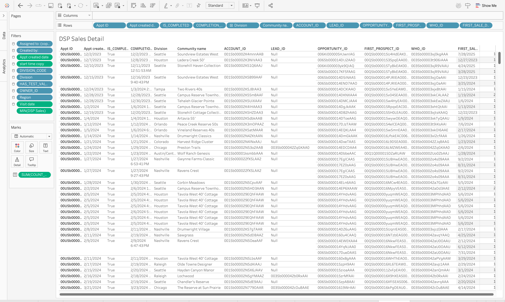
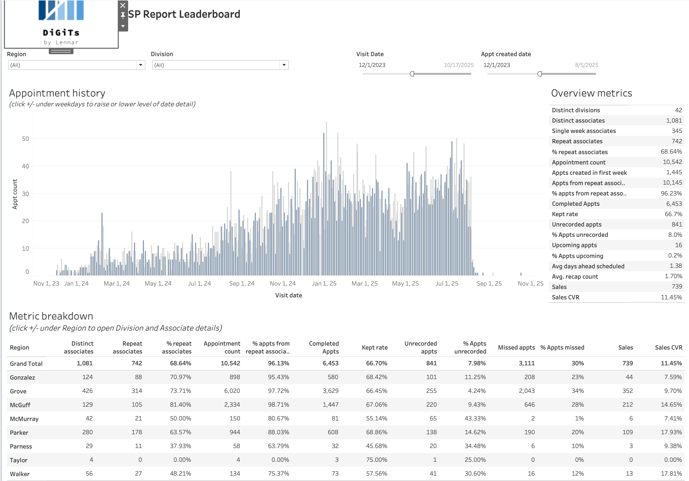
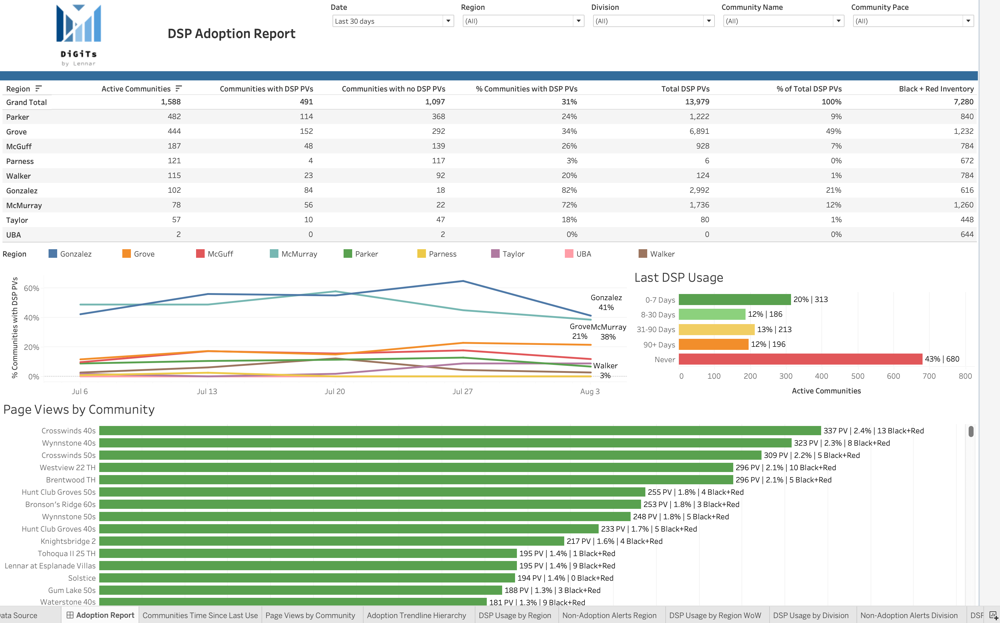

# DSP Adoption Dashboard (Synthetic)

[](https://www.tableau.com/)
[](LICENSE)
[](#)

A sanitized, portfolio-ready analytics project modeling adoption of a Digital Sales Presentation (DSP) across Regions → Divisions → Communities. It demonstrates hierarchy-aware KPIs, relative-date responsive usage buckets, and a clean SQL backbone that counts only days when communities are active.

---

## Table of contents
- [Features](#features)
- [Screenshots](#screenshots)
- [Screenshots and Attribution](#screenshots-and-attribution)
- [Data model](#data-model)
- [Key calculations](#key-calculations)
- [Run locally](#run-locally)
- [Why this is interesting](#why-this-is-interesting)
- [Impact](#impact)
- [Project structure](#project-structure)
- [PRD and Architecture](#prd-and-architecture)
- [License](#license)

## Features
- Hierarchical dashboard: Region → Division → Community
- Core KPIs: Active Communities, Communities with DSP PVs, % Adoption, Total PVs, Ready Inventory (Black+Red), Pace Status
- Relative-date responsive usage buckets: 0–7, 8–30, 31–90, 90+ days, Never
- Fast, accurate SQL: replaces a static date spine with an “active-days only” backbone
- Synthetic dataset and redacted SQL so you can reproduce locally

## Screenshots
Add your images to `screenshots/` and they’ll render here:



Optional extras:
- 
- 

## Screenshots and Attribution
- No confidential data is included in this repository; all data have been switched to fully synthetic representations.
- Screenshots are illustrative only and may include brand marks; they are provided for portfolio demonstration of work experience.
- Trademarks and logos are property of their respective owners.

## Data model
- Daily event grain for page views; weekly snapshot for inventory/pace
- “Active-days” backbone: only count dates where a community is active
- See `sql/adoption_core_redacted.sql` for the redacted, production-aligned query

## Key calculations
See `docs/calculations.md` for the exact expressions, including:
- Adoption (% communities with PVs)
- Filter-responsive “Last Usage” buckets using `MAX([Event Date])` from the filtered range
- Ready Inventory using community-level `MAX()` snapshots

## Run locally
```bash
python3 scripts/generate_synthetic_data.py
```
Open the Tableau workbook (if added later) under `tableau/`, or review screenshots above.

## Why this is interesting
- Demonstrates practical Tableau LOD patterns and date-filter-aware logic
- Shows how to join mixed-grain sources (daily events + weekly snapshots) cleanly
- Communicates a stakeholder-ready narrative for product adoption

## Impact
- Enables product owners to pinpoint Regions/Divisions/Communities with low DSP usage, especially when inventory is high or pace is behind.
- Establishes accurate denominators by counting only active community-days, improving trust in adoption KPIs.
- Standardizes drill-down reporting and reduces duplicate worksheets by consolidating hierarchy views and filter actions.

## Project structure
- `data/` synthetic CSVs
- `scripts/` data generator
- `sql/` redacted SQL (`adoption_core_redacted.sql`)
- `docs/` calculation notes and demo script
- `screenshots/` images for the README
- `tableau/` optional workbook wired to the synthetic data

## PRD and Architecture
- PRD: `docs/prd.md`
- Architecture (Mermaid): `docs/architecture.mmd`

## License
MIT
